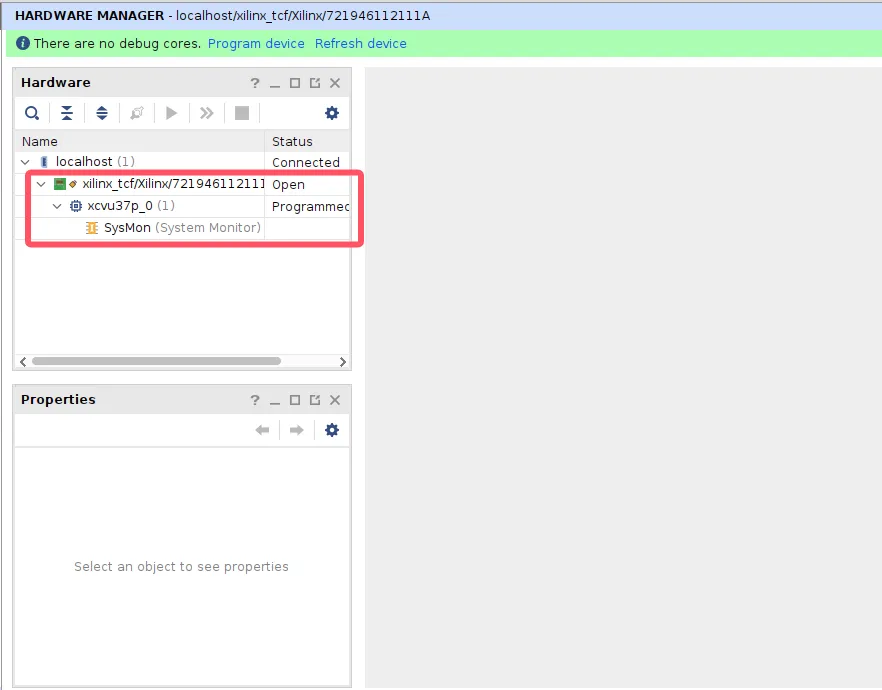

## Software and hardware

为了能运行 firesim，你需要准备如下软硬件环境：
软件环境：
- Ubuntu 20.04 LTS（OS recommended by Xilinx，避免 Xilinx 工具发生一些奇怪的错误）
- clash for linux（加速各种库各种依赖安装速度，否则可能会卡死在某个脚本）
- vivado 2023.1（生成能够烧写到 fpga 板子上的 bitstream）

硬件环境：
- CPU  11th Gen Intel(R) Core(TM) i5-11500 @ 2.70GHz
- RAM 4*16g（32g、48g 或许也够了）
- VCU128（FPGA board）
  - 六孔电源适配器（最好使用厂家自带的）
  - micro-usb 用于烧写 bit 流
  - PCIE 延长线（板子太大，无法插进机箱的情况）

## 安装 FPGA 板子到机箱

To install the board in a PC chassis：
1. Power down the host computer and remove the power cord from the PC.
2. 将六孔电源适配器的两端分别插到电源插座和 FPGA 板子上
3. 将 micro-usb 的两端分别插到主机和 FPGA 板子上
4. 将 PCIE 延长线插进主板的 PCIE 口，然后将 FPGA 板子插进 PCIE 延长线
5. 拨动 FPGA 板上的 power on 开关，主机开机
上述步骤都完成后如下图：

以下的步骤用于检测 jtag 和 PCIE 连接是否成功
打开 vivado，open-Hardware-Manager，open-target，auto-connect，如果如下图所示，说明 jtag 连接成功，可以将 bitstream 烧写进 FPGA board：

因为 Firesim 是利用 XDMA ip 核通过 PCIE 实现主机和 FPGA 板卡的通信，因此我们还需要检查 PCIE 连接是否成功，建议运行 https://github.com/WangXuan95/Xilinx-FPGA-PCIe-XDMA-Tutorial 中的例程一，如果输入 lspci 能够看到 xilinx 设备，说明 PCIE 连接成功：

firesim 官方支持的 FPGA 板卡可以直接烧写官方提供的 bitstream，如果不是官方支持的板卡，就需要执行 firesim buildbitstream 来生成对应的比特流。
不同的板卡支持不同的 PCIE 接口，并且 fpga 型号也不同，因此需要修改 blockdesign，如果修改后得到的 blockdesign 生成的 bitstream 能提供 firesim 需要的接口，移植最重要的一步就走通了，其余文件的修改就是令生成 rtl、生成 bitstream、跑 workload 等任务自动化。具体需要修改的文件可以参考：support-vc707.md。